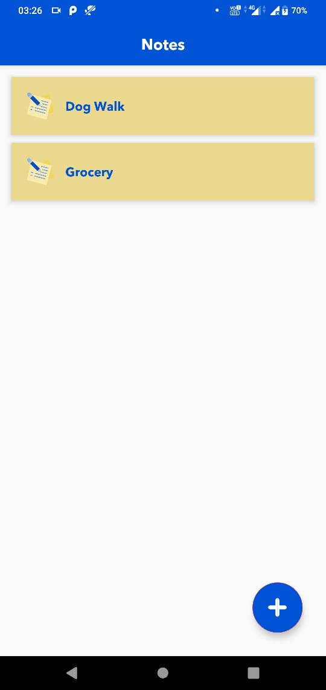
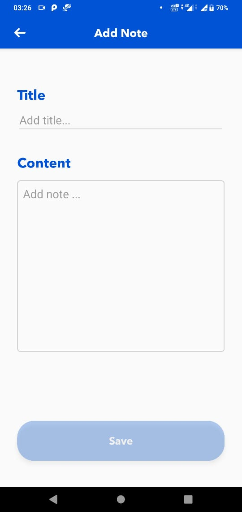
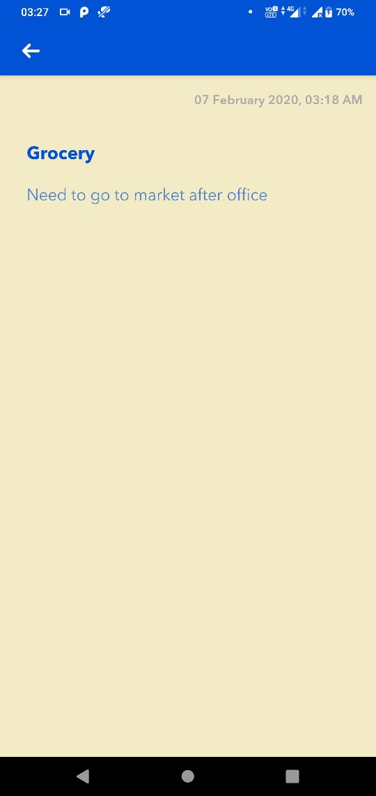

# BasicNoteApp (Kotlin,MVVM,Livedata,Dagger2,Realm)

## Preview
 &nbsp;&nbsp;

## Feature details :

### This app contains three screens : 
 &nbsp;&nbsp;
 &nbsp;&nbsp;
 &nbsp;&nbsp;

#### First screen1 : It shows all notes which are saved in DB (Realm).
#### First screen2 : Add a new note.Here there are two fields one for title and other for content,there fields can't be empty.Until both the fields are not filled save button will be faded and non-clickable.
#### First screen3 : Preview a note.
